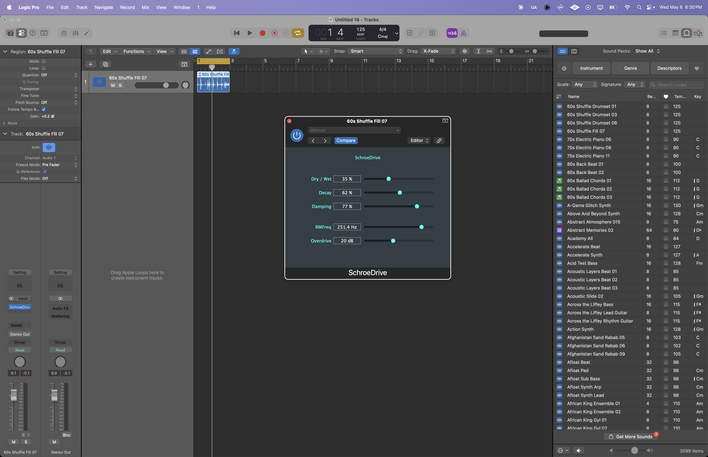

# SchroeDrive — JUCE Reverb/Modulation Distortion Plugin

---

## Plugin Interface

-purple)

SchroeDrive is a JUCE-based audio plugin combining Schroeder-style reverb, ring modulation, damping control, wet/dry blending, and nonlinear overdrive processing. The project explores spatial processing, harmonic coloration, and modulation-driven DSP techniques through a real-time audio workflow.

---

## Features

- **Schroeder-style reverb processing**
  - Multi-stage reverberation structure

- **Wet/Dry control**
  - Adjustable signal blend

- **Damping control**
  - Frequency-dependent decay shaping

- **Ring modulation**
  - Harmonic and metallic modulation textures

- **Overdrive processing**
  - Nonlinear harmonic enhancement

- **Parameter-based architecture**
  - JUCE AudioProcessorValueTreeState (APVTS)

---

## File Contents

| File | Description |
|---|---|
| `PluginProcessor.cpp` | Core DSP processing logic |
| `PluginProcessor.h` | Processor class definition |
| `PluginEditor.cpp` | GUI layout and parameter attachments |
| `PluginEditor.h` | Editor class definition |
| `LFO.cpp` | Low frequency oscillator implementation |
| `LFO.h` | LFO class definition |
| `SchroeDrive.jucer` | JUCE project configuration |
| `README.md` | Project documentation |

---

## Technical Overview

The plugin architecture is built around:

- JUCE AudioProcessor
- AudioProcessorValueTreeState (APVTS)
- Real-time reverb processing
- Modulation-based DSP structures
- Nonlinear overdrive processing
- Parameter-controlled signal routing

The plugin combines Schroeder-inspired reverberation with modulation and distortion stages to create spatially enhanced and harmonically rich sound textures. Ring modulation and overdrive processing allow for experimental coloration while damping and wet/dry controls shape the overall ambience and response.

---

## How to Build

1. Install JUCE
2. Open `SchroeDrive.jucer` in Projucer
3. Generate Xcode project files
4. Open in Xcode
5. Build AU/VST3 target

---

## Requirements

- JUCE Framework
- Xcode (macOS)
- C++17 or later

---

## Future Enhancements

- Additional modulation modes
- Expanded reverb parameter controls
- Visual signal metering
- Preset management system
- Cross-platform builds (Windows)

---

© Henry Powell — Audio DSP Development
